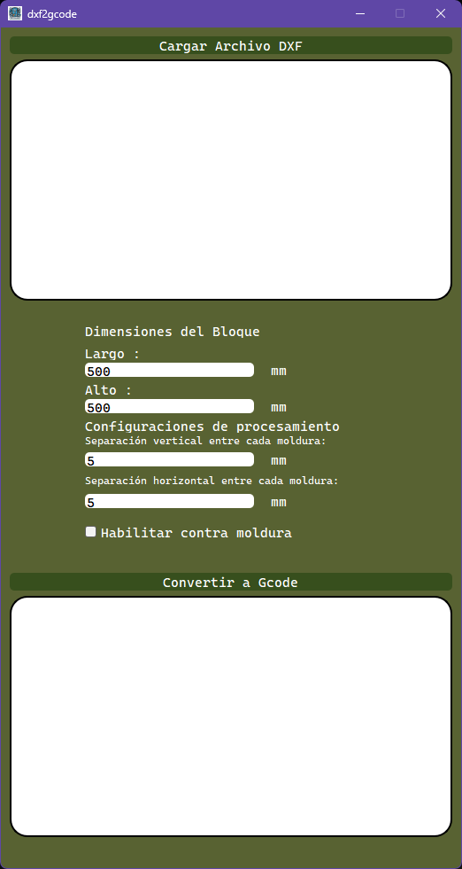
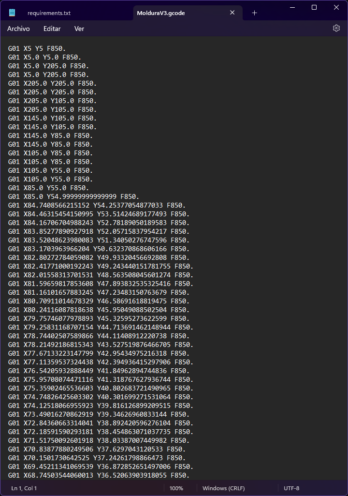
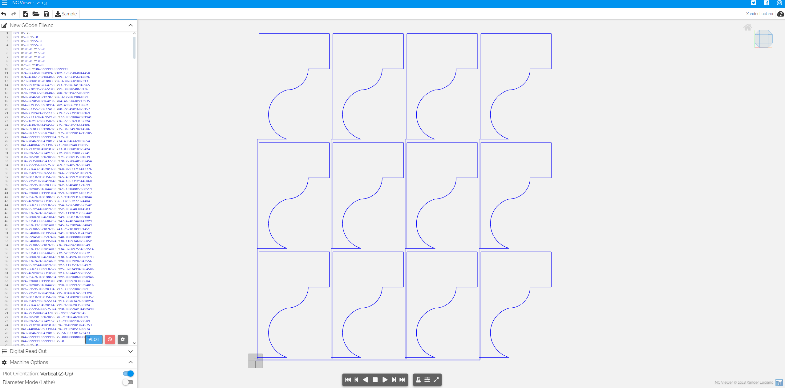

# DXF to G-code Converter

## Descripción
Este proyecto presenta una herramienta especializada en la conversión de archivos DXF en 2D a G-code. Fue desarrollado específicamente para respaldar un proyecto de tesis centrado en una máquina cortadora de molduras en bloques de unicel utilizando un alambre caliente.

Dado que la máquina está equipada con un alambre que se desplaza de un lado a otro, el uso de cualquier generador de G-code convencional no es viable. Muchas máquinas permiten levantar o retirar la herramienta y moverse libremente para continuar generando código. Sin embargo, en este caso particular, tal enfoque resultaría en cortes de molduras en el centro, arruinando el proceso completo.

Comparto este código en caso de que alguien esté trabajando en un proyecto de CNC similar y necesite generar su propio código G. Este software proporciona una guía clara sobre cómo abordar este proceso específico, teniendo en cuenta las limitaciones de la máquina.

La herramienta permite cargar un archivo DXF, especificar dimensiones, es decir, un área determinada, y ajustar parámetros de empaquetado como la separación entre cortes. Posteriormente, genera un archivo G-code listo para ser utilizado en la máquina CNC diseñada para este propósito.

## Características
- Carga archivos DXF y muestra una vista previa.
- Permite especificar dimensiones de bloque y separaciones horizontal y vertical.
- Convierte las entidades del archivo DXF en G-code para empaquetar bloques.

## Requisitos
- Python 3.x
- PyQt5
- ezdxf
- Matplotlib
- Numpy

## Instrucciones de Uso
1. Clona este repositorio: `git clone https://github.com/tu-usuario/tu-repositorio.git`
2. Instala las dependencias: `pip install -r requirements.txt`
3. Ejecuta la aplicación: `python main_dxf2gcode.py`

## Capturas de Pantalla

## Contribuciones
Las contribuciones son bienvenidas. Si encuentras algún problema o tienes una mejora, ¡no dudes en abrir un problema o enviar un pull request!

