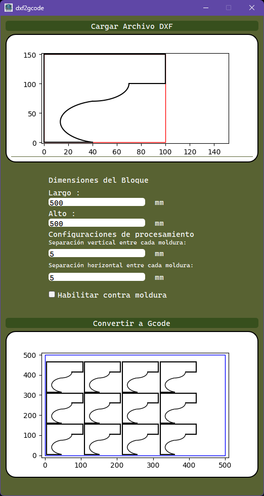

# DXF to G-code Converter

## Descripción
Este proyecto es una herramienta de conversión de archivos DXF a G-code. Permite cargar un archivo DXF, especificar dimensiones y parámetros de empaquetado, y generar un archivo G-code para su uso en máquinas CNC.

## Características
- Carga archivos DXF y muestra una vista previa.
- Permite especificar dimensiones de bloque y separaciones horizontal y vertical.
- Convierte las entidades del archivo DXF en G-code para empaquetar bloques.

## Requisitos
- Python 3.x
- PyQt5
- ezdxf
- Matplotlib
- Numpy

## Instrucciones de Uso
1. Clona este repositorio: `git clone https://github.com/tu-usuario/tu-repositorio.git`
2. Instala las dependencias: `pip install -r requirements.txt`
3. Ejecuta la aplicación: `python main.py`

## Capturas de Pantalla

## Contribuciones
Las contribuciones son bienvenidas. Si encuentras algún problema o tienes una mejora, ¡no dudes en abrir un problema o enviar un pull request!

